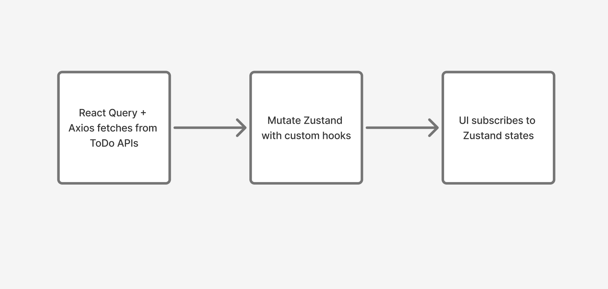

# Kalachakra Todo React Reyhan

## Running Project

This app is available at: <https://elysmaldov.github.io/kalachakra-todo-react-reyhan/>

If you want to run locally:

1. npm install
2. npm run dev
3. To build:
   1. npm run build
   2. npm run preview

## Technical Overview

This ToDo app utilizes React with Vite and Tailwind CSS for the UI, with interaction with API using Axios and React Query, and state management using Zustand. The approach to data fetching and mutation utilizes optimistic UI updates and local-first operations. In short, data is fetched and mutated using Axios through React Query with custom hooks; and anytime an operation happens that queries or mutates the data, we update our Zustand store and all other components only need to subscribe to specific Zustand states. This way, data fetching and data usage are decoupled.

<!-- TODO add image -->


## Folder Structure

```
└── 📁src
    └── 📁components // UI components
        └── 📁buttons // Common buttons
        └── 📁dialogs // Common dialogs
        └── 📁hooks // Custom hooks, mainly has React Query and Zustand hooks
        └── 📁icons // Common icons
        └── 📁inputs // Common inputs
        └── 📁store // Has todo store
        └── 📁todos // Todo specific components
    └── 📁lib
        └── 📁apis
            └── 📁todo-api 
                └── 📁utils // Helper functions to CRUD API
                ├── instance.ts // Axios instance for ToDo API
        └── 📁optimistic-data // Helpers to create data like Todo
        └── 📁react-query
        └── 📁types
    └── 📁models // Models used in the App (Todo for now)
    └── 📁pages // Pages to render in React Router paths
    └── 📁styles
```

## Task Progress

- [X] Create Todo
- [X] Get All Todo
- [X] Apply Filters on Get All Todo
- [X] Mark Todo as Done / Undone
- [X] Update Todo
- [X] Delete Todo

## Features

### React + Tailwind v4

I use React and Tailwind v4 with custom themes from the Figma file to create custom UIs.

### Zod + React Hook Form

Data validation uses Zod based on the models schema and to easily receive and validate the user input, React Hook Form is used.

### React Router DOM

React Router DOM has been setup to render pages and nested routes. Nested routes are used to render dialogs (for example creating and editing a Todo). The dialogs render above the page and covers the background page using an overlay without losing the data. `useNavigate` is used to open/close the dialogs.

### Axios Data Fetching with React Query and Suspense

Data fetching uses axios library to have a nicer and more organized API interface. I created a `todoAPIInstance` and helper async functions to handle interacting with the ToDo API. React Query is utilized to cache the data. To provide a more snappy experience, I use React Query in Suspense mode (`useSuspenseQuery`) to fetch the todo data so users can instantly access the app and I show them a loading component until the data comes through.

### Optimistic UI Updates with Zustand and React Query Custom Hooks

Most components have access to the todo Zustand store `useTodoStore` that contains fields and methods to help interact with the todo data. Most components subscribes to a specific part of the store so only updates to those states will trigger a re-render. This way, I utilize Zustand as the main source-of-truth.

Integrating with React Query, I utilized custom hooks and optimistic update functionality of React Query where everytime the user updates their todo, it will update the Zustand store first even before the API call is finished. This way, users can quickly interact with the UI without waiting for the API response. If an error happens, the Zustand store will revert; otherwise it will invalidate the local cache to sync the data with the server.
